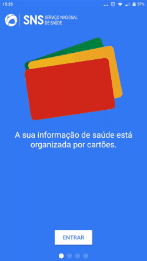
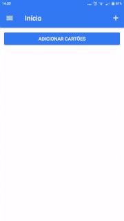

# Introdução

### Sobre esta documentação {#sobre}
Este documento pretende ser um guia completo para a MySNS Carteira, doravante designada por CeS - Carteira Electrónica da Saúde. Contém toda a documentação para o funcionamento da perpectiva do utilizador bem como todos os recursos para o setup e desenvolvimento.

### O que é a MySNS Carteira? {#ces}

A MySNS Carteira, reúne a informação de saúde do cidadão numa aplicação residente no seu smartphone, construída de acordo com o interesse do cidadão, que escolhe concretamente a informação pretende guardar na MySNS Carteira. 

A MySNS Carteira é uma aplicação “vazia de conteúdo”, cabendo ao cidadão, de forma voluntária e ativa, escolher a informação que pretende nela incluir.  
É uma plataforma de disponibilização de informação de saúde, associada ao cidadão através do seu número de Utente SNS e validada com a informação presente no Registo Nacional de Utente (RNU), onde o cidadão associa “cartões” específicos por componentes informativas do seu interesse.

A MySNS Carteira é construída de forma a garantir os dois pilares essenciais da disponibilização de informação em formato eletrónico, de acordo com as boas práticas internacionais de segurança:
1.  Segurança (Security e Safety) – toda a informação é guardada de forma segura, usando standards internacionais, nomeadamente: AES, RSA;
2.  Identidade Digital do Cidadão (eID) – na ativação da aplicação é garantido que quem acede é quem diz que é.

### Como ativar {#ativar}

Após descarregar a aplicação das lojas específicas para o dispositivo ([Android](https://play.google.com/store/apps/details?id=pt.minsaude.spms.ces) e [iOS](https://itunes.apple.com/pt/app/mysns-carteira/id1192353854)), o primeiro passo é a ativação da MySNS Carteira; esta ativação tem como objetivo associar o dispositivo móvel ao cidadão, para efeitos de identificação digital (eID). 

Este passo pode ocorrer de duas formas:
1.  Utilização de Chave Móvel Digital (CMD);
2.  Utilização do Número de SNS + Data de Nascimento + Número de Telemóvel.

Relativamente ao uso da CMD, esta é efetuada em conformidade e nos termos da Lei n.º 37/2014, de 26 de junho, diploma que estabelece um sistema alternativo e voluntário de autenticação dos cidadãos nos portais e sítios na Internet da Administração Pública denominado Chave Móvel Digital.
O segundo método implica o registo dos dados na aplicação pelo cidadão (preenchimento de número do SNS, data de nascimento e número de telemóvel). Esta informação é depois cruzada com a informação existente no RNU, sendo que:

*   Caso os três dados sejam coincidentes, é enviado automaticamente um SMS para o número de telemóvel fornecido (e validado no RNU) com um código (TOTP) que deve ser introduzido na CeS para ativação. 

*   Caso alguns dos dados não esteja correto, a aplicação devolve ao Cidadão uma mensagem informando que este se deve dirigir ao seu Centro de Saúde para, junto de um profissional, proceder à atualização da informação constante do RNU. Os dados inseridos inicialmente não são guardados, sendo necessário repetir toda a operação de ativação, desde o inicio.
Independentemente do método escolhido, a conclusão da ativação da MySNS Carteira é feita com a escolha de um pin pelo cidadão, para proteção (com recurso a encriptação) da informação constante da carteira, ou seja, o acesso à informação só é feito se o cidadão colocar o pin (mesmo com o dispositivo desbloqueado, não é possível aceder aos cartões sem a introdução do pin). Será também disponibilizada uma opção para alteração do pin.
No entanto, para melhorar a usabilidade da MySNS Carteira, o pin pode ser associado ao mecanismo de leitura de impressão digital, se disponível no dispositivo.

### Como adicionar cartões {#addcartoes}

O cidadão poderá associar “cartões” específicos por componentes informativas do seu interesse. Até ao momento, estão disponiveis os seguintes cartões:

RNU – Cartão de Utente;

ADSE – Cartão da ADSE;

eGuias de Tratamento – guias de tratamento com códigos de dispensa relativos à Receita Sem Papel;

Para adicionar cartões deverá utilizar o botão .

Se a carteira estiver livre de cartões, poderá também utilizar o botão .

  

### Como Terminar Sessão {#terminar}

Para terminar sessão, basta ir ao menu esquerdo  e nas **Definições** irá encontrar a opção **Terminar Sessão**

