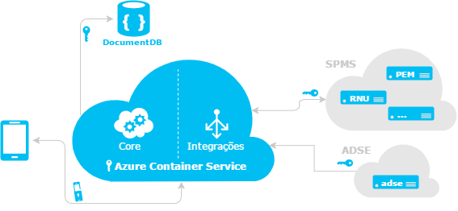
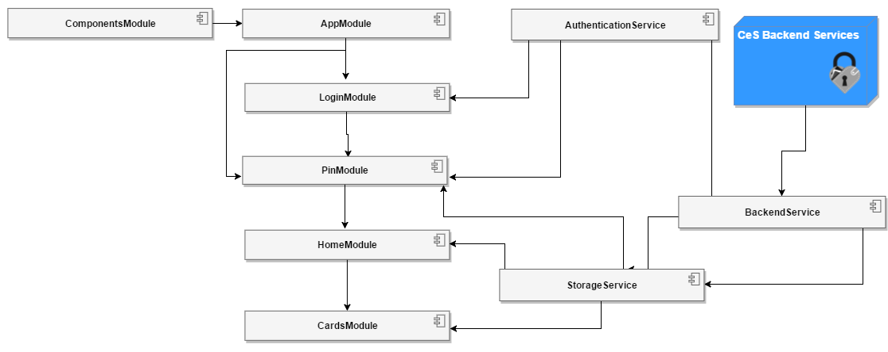

#Arquitetura da Aplicação

A aplicação CeS é desenvolvida em Angular 2, pelo que apresenta a arquitectura demonstrada no  diagrama anterior. 
De o modo geral, é constituida por 2 componentes gerais: **Módulos** e **Componentes**. 

###Módulos

Entre os módulos, cada um destes tem a sua responsabilidade, facilitando assim uma manutenção mais simples.

**AppModule** -  Cada aplicativo tem pelo menos um módulo Angular, o módulo raiz (_root_) que inicia o aplicativo. Cartões de Introdução e Error (páginas de erro), 

**PinModule** - modulo para registo do PIN da Carteira, autenticação e mudança de PIN, com ligação ao serviço encriptado de Autenticação. O PIN fica guardado apenas no armazenamento do dispositivo móvel (Storage Service).

**LoginModule** - componente de autenticação na aplicação. Mediante o serviço de autenticação escolhido (Chave Móvel Digital ou Registo Nacional de Utente )

**CardsModule** - Coteúdo dos cartões (view de Cartões da CeS em detalhe)  

**HomeModule** - view de Cartões da CeS (vista fechada), Menus ( Settings e About), CardsList, adicionar, visualizar e remover cartões.

**ComponentsModule** - componentes de interface (navigation drawer, scroll, etc)

###Serviços

**AuthenticationService** - Autenticação e ligação aos servidores  (Backend) de forma segura e encriptada.

**BackendService** - ligação às base de dados dos vários sistemas de informação (centrais e locais) e o Servidor CeS (Azure Container Service -Docker Swarm) é feita usando o protocolo HTTPS (ver diagrama 1)

Toda a informação trocada é ainda encriptada e assinada digitalmente usando os algoritmos de encriptação RSA (2048 bit) e AES (256 bit). O formato de dados utilizado é [JSON
Object Signing and Encryption (JOSE)](https://datatracker.ietf.org/wg/jose/documents/). O par de chaves RSA do servidor está alojado no Azure Key Vault, sendo as operações de assinatura e desencriptação efetuadas lá.

**Storage Service** - Serviço de armazenamento de dados no dispositivo móvel, devidamente encriptado. Através deste serviço, é armazenado o PIN, Home View e os cartões. 

**CeS Backend Services** - conjunto de serviços de apoio ao funcionamento da CeS (autenticação, comunicação, telemetria.)

### Comunicação

